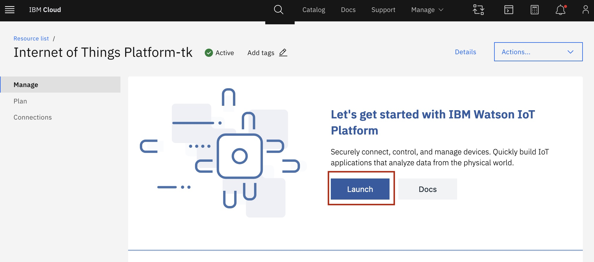
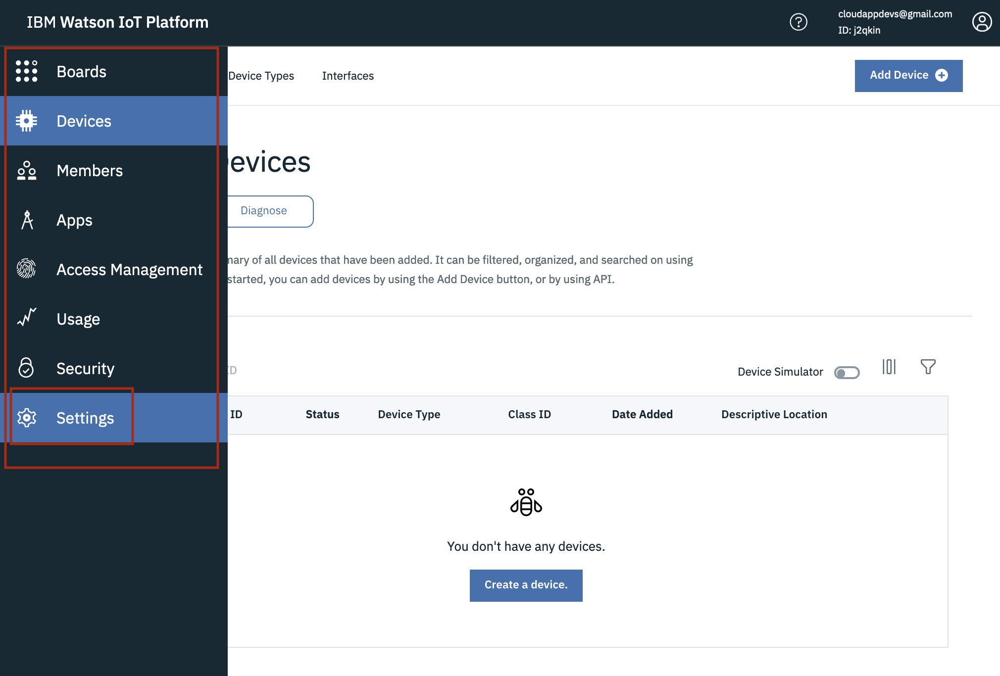
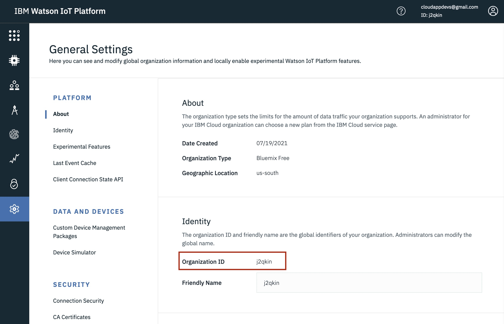

## Setting up the IBM Watson IoT Platform

In order for the Pyrrha Device to communicate with the internet, you need to create a device in the IBM Watson IoT Platform. Creating a device allows you to connect your an IoT device (in this case, Pyrrha) to IBM Watson. You are telling IBM Watson to let the device connect to the internet and receive its data.

## Get started

- [Setting up the IBM Watson IoT Platform](#setting-up-the-ibm-watson-iot-platform)
- [Get started](#get-started)
- [Create IBM IoT Service](#create-ibm-iot-service)
- [Connect a Pyrrha device to IBM Watson IoT Platform](#connect-a-pyrrha-device-to-ibm-watson-iot-platform)
- [Connect an application to IBM Watson IoT Platform](#connect-an-application-to-ibm-watson-iot-platform)
- [Obtain organization ID from the IoT platform](#obtain-organization-id-from-the-iot-platform)

## Create IBM IoT Service

Follow these steps to create an IBM IoT service

1. Create an IBM Cloud account through [this link](https://cloud.ibm.com/registration?cm_sp=Developer-_-cfc2021projects-_-ov78713&eventid=cfc2021projects&lang=en_US&target=https%3A%2F%2Fdeveloper.ibm.com%2Fdwwi%2Fjsp%2Fp%2Fpostregister.jsp%3Feventid%3Dcfc2021projects%26lang%3Den_US). Fill out all the required information and confirm your email address.

2. Follow this link to provision an instance of the [IBM Watson IoT Platform](https://cloud.ibm.com/catalog/services/internet-of-things-platform). Note: you can also find this by [browsing through the catalog](https://cloud.ibm.com/catalog#services).

3. Make sure the Lite plan is selected and click `Create`. You can change the `Service Name` if you want to, but it's not required.
   

4. After the service provisions, click `Launch`.
   

---
## Connect a Pyrrha device to IBM Watson IoT Platform

Follow these steps to connect a device to IBM Watson IoT Platform

1. Click on `Devices` located on the left toolbar, and then select `Add Device`.
   

2. Enter your `Device Type` and `Device ID`, then click `Next`.
   

3. Filling out anything in the `Device Information` tab is optional, click `Next`.
   

4. Leave the field for `Authentication Token` blank, as one will be generated automatically. You can specify your own if you prefer. Click `Next`.
   

5. Ensure that the `Summary` page looks good, then click `Finish`.
   

6. You'll see the authentication token listed, ensure that you do not misplace it, otherwise, you will have to regenerate a new token.
   

---
## Connect an application to IBM Watson IoT Platform

Follow these steps to connect an application to IBM Watson IoT Platform.

1. Click on `Apps` located on the left toolbar, and then select `Generate API Key`.
   

2. Write a description and once you are done click `Next`, Keep `API Key Expires` off.
   

3. The role should be `Visualization Application`, if not click on the toolbar and select it. Then click `Generate Key`.
   

4. The `API Key` is your `IOT_USERNAME` and the `Authentication Token` is your `IOT_PASSWORD`.
   

5. In the `.env` file , fill in the information of the `IOT_USERNAME` & `IOT_PASSWORD` from step 8^.
   

---
## Obtain organization ID from the IoT platform

Follow these steps to obtain your organization ID to use in environment files:
1. Log into your IBM Cloud account.
2. Look for the IoT service under resources and launch the IoT platform.
   
3. Hover over the left menu to open it and then open `Settings`
    
4. You can find your organization ID under `Identity`
   
